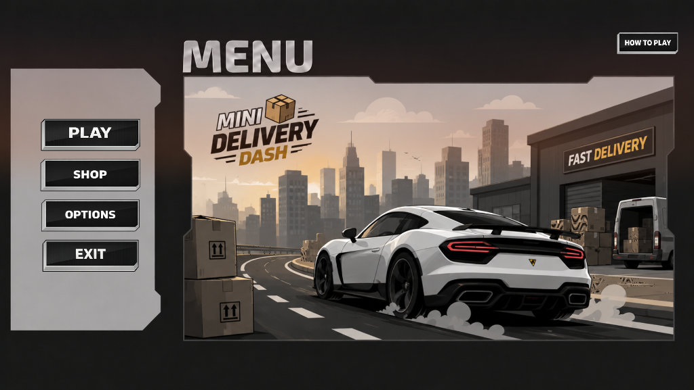
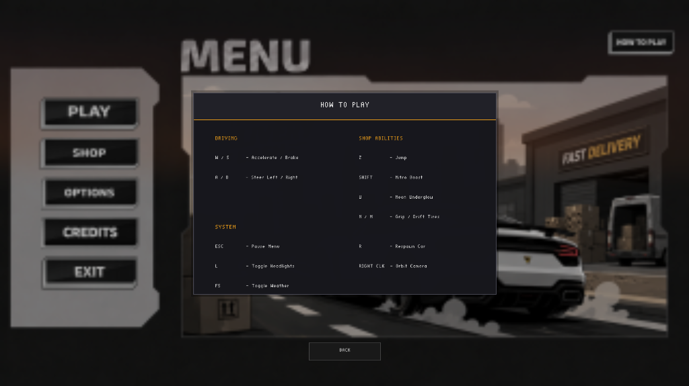
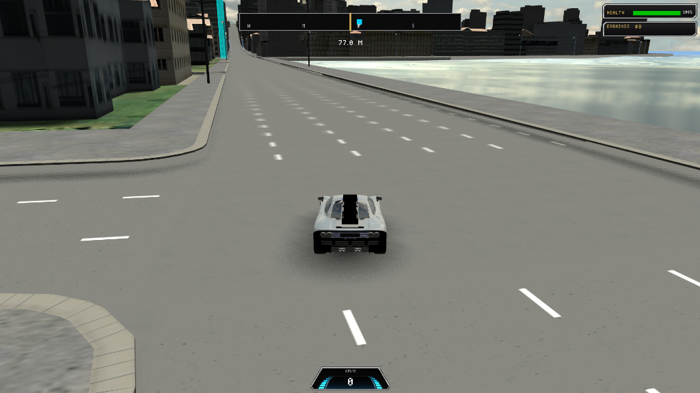
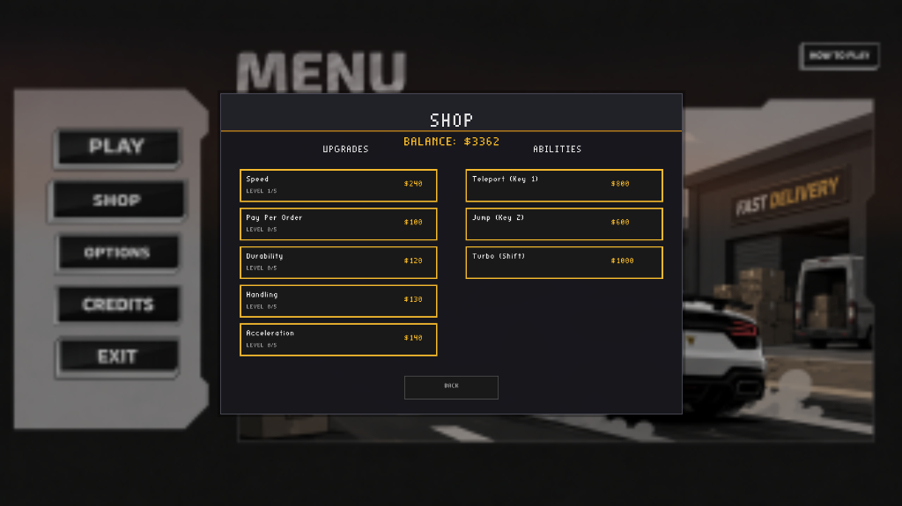

# Mini Delivery Dash

[](https://youtu.be/Qu6uDCl_sVg)

**Mini Delivery Dash** is a 3D graphics and gameplay project built from scratch using C++ and OpenGL. The game focuses on an arcade-style driving experience where players navigate through a beautifully rendered 3D city to complete delivery missions. Players can earn money, visit the shop to upgrade their vehicle, and enjoy dynamic lighting, audio, and physics.

## Key Features

Based on the development history, the project includes the following advanced features:
- **Arcade Driving Physics & Collisions:** Custom car mechanics including acceleration, steering, jumping, turbo boost, and dynamic collisions with the city environment.
- **Dynamic Lighting & Graphics:** Implementation of dynamic street lamps (spotlights), shadows, headlights, and a fully rendered 3D city mesh with frustum culling.
- **Delivery System:** Real-time coordinate sampling to generate random delivery missions with calculated distances and rewards.
- **Interactive UI & Shop System:** A completely customized and responsive 2D Graphical User Interface (GUI). Features include a dynamic Main Menu, Pause Menu, "How To Play" section, and a Shop where players can purchase upgrades (Speed, Handling, Durability) and abilities.
- **Immersive Spatial Audio:** Integrated audio engine using OpenAL for realistic motor sounds, ambient music, and menu/delivery background tracks.
- **Visual Effects:** Frosted-glass UI blur effects, dynamic tire animations, water boundaries, and interactive camera orbiting.

## Technologies Implemented

This project was built without a commercial game engine, utilizing the following core technologies:
- **C++ (11/14/17+)**: Core programming language.
- **OpenGL**: Low-level 3D graphics API.
- **GLFW & GLEW**: Window creation, input handling, and OpenGL extension loading.
- **GLM (OpenGL Mathematics)**: Vector and matrix mathematics.
- **OpenAL**: 3D spatial audio API.
- **stb_image**: Texture image loading.
- **CMake**: Cross-platform build system.

## Authors

This project was developed collaboratively by:
- **Espinoza Saenz Isaac Antonio** (2024–1873U)
- **Lira Zavala Kenry Onell** (2024-1898U)
- **Morales Matamoros Erick Antonio** (2024–1935U)
- **Orozco Jarquín Gustavo Adolfo** (2024–1938U)

## How to Clone and Run Locally

Follow these step-by-step instructions to compile and play the game on your local machine.

### Prerequisites
- Git
- CMake (version 3.10 or higher)
- A C++ Compiler (MinGW, MSVC, or GCC/Clang)
- Graphics card with OpenGL 3.3+ support

### Step-by-Step Installation

1. **Clone the Repository:**
   Open your terminal or command prompt and run:
   ```bash
   git clone https://github.com/Espinoza08-iaes/Mini-Delivery-Dash-co.git
   cd Mini-Delivery-Dash-co
   ```

2. **Create a Build Directory:**
   Generate the necessary build files using CMake:
   ```bash
   mkdir cmake-build
   cd cmake-build
   ```

3. **Configure the Project with CMake:**
   ```bash
   cmake .. -DCMAKE_BUILD_TYPE=Debug
   ```
   *(Note: Depending on your compiler, you might need to specify a generator, e.g., `cmake .. -G "Visual Studio 17 2022"`).*

4. **Compile the Game:**
   ```bash
   cmake --build . --config Debug
   ```

5. **Run the Game:**
   After a successful compilation, execute the game:
   - On Windows: `.\MiniDeliveryDash.exe`
   - On Linux/Mac: `./MiniDeliveryDash`

## Controls

- `W` / `S` - Accelerate / Brake
- `A` / `D` - Steer Left / Right
- `Z` - Jump
- `SHIFT` - Nitro Boost
- `U` - Neon Underglow
- `N` / `M` - Grip / Drift Tires
- `R` - Respawn Car
- `RIGHT CLK` (Hold & Drag) - Orbit Camera
- `ESC` - Open Pause Menu
- `L` - Toggle Headlights
- `F5` - Toggle Weather

## Standalone Executable (Play Without Compiling)

If you just want to play the game without building it from source, you can download the pre-packaged executable from the **Releases** tab on GitHub.

1. **Extract the Game:** Unzip the downloaded `MiniDeliveryDash_Release.zip` into your preferred location (e.g., your Documents folder).
2. **Important Rule:** Do **NOT** separate the `MiniDeliveryDash.exe` file from the `res/` folder. The executable requires the resources folder to be in the exact same directory to load models, textures, and audio correctly.
3. **Play from Desktop:** To have the game accessible from your Desktop like a standard Windows application:
   - Right-click on the `MiniDeliveryDash.exe` file.
   - Select **Show more options** (on Windows 11) -> **Send to** -> **Desktop (create shortcut)**.
   - You will now have a neat shortcut on your Desktop with the game's icon. Double-click it to start playing!

### How to Create the Windows Release Build (.zip)

If you are a developer and want to generate this standalone `.zip` package yourself, use the following PowerShell commands from the project root:

1. **Configure and Compile the Project:**
   ```powershell
   cmake -G "MinGW Makefiles" -B build
   cmake --build build
   ```

2. **Package the Executable and Resources:**
   Once the executable is generated in the `build/` folder, compress it alongside the `res/` folder into a `.zip` file:
   ```powershell
   Compress-Archive -Path "build\MiniDeliveryDash.exe", "res" -DestinationPath "MiniDeliveryDash_Release.zip" -Force
   ```

## Screenshots

### Main Menu


### How To Play


### In-Game Delivery


### Shop Interface


---
*Developed for the Graphics Programming (Programación Gráfica) Course.*
