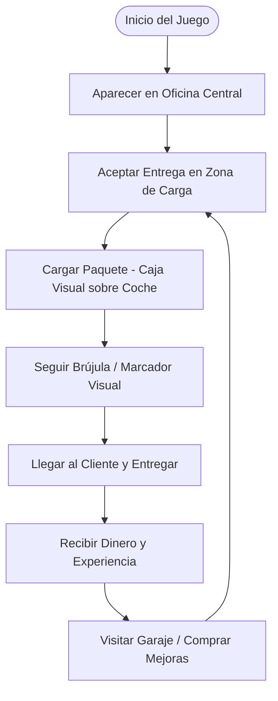

# Plan de Mejoras - Cozy Delivery Simulator (Estilo "Easy Delivery Co.")

Para transformar **Mini Delivery Dash** en un juego inmersivo y acogedor similar a **Easy Delivery Co.**, proponemos estructurar las mejoras en cuatro fases de desarrollo. Esto convertirá la simulación técnica actual de conducción en un bucle de juego divertido, funcional y visualmente atractivo utilizando OpenGL.



---

## 📅 Fases de Desarrollo Propuestas

### Fase 1: El Bucle de Entregas (Core Gameplay)
Implementar el ciclo básico de trabajo del repartidor.

| Elemento | Descripción | Detalle Técnico |
| :--- | :--- | :--- |
| **Zonas de Carga/Descarga** | Marcadores visuales luminosos en el mapa. | Cilindros translúcidos renderizados con blending (`GL_SRC_ALPHA`) en el shader de la ciudad. |
| **Transporte de Cajas** | Indicador visual de que llevas un paquete. | Renderizar un pequeño modelo de caja (`cube.obj`) fijado al techo del McLaren cuando el paquete está activo. |
| **Sistema de Recompensas** | Dinero y puntuación al entregar. | Al colisionar con el punto del cliente, se suma dinero y se genera una nueva entrega aleatoria. |

### Fase 2: HUD en Pantalla y Navegación
Evitar que el jugador se pierda y mostrar la información directamente en el juego en lugar de en la barra de título de la ventana.

*   **Flecha de Navegación 3D:** Una flecha flotante tridimensional sobre el coche que rota en el eje Y apuntando directamente hacia el destino actual.
*   **HUD de Texto / Gráficos en 2D:** Renderizar texto y texturas usando una matriz de proyección ortográfica (`glm::ortho`) para mostrar:
    *   Dinero acumulado ($)
    *   Distancia al objetivo (metros)
    *   Nombre del paquete / Nombre del cliente
    *   Velocidad actual en un velocímetro visual

> [!TIP]
> Podemos utilizar una pequeña textura circular cargada con SOIL2 para crear un minimapa o una brújula en la esquina inferior izquierda.

### Fase 3: Ambiente Acogedor y Clima (Cozy Atmosphere)
El estilo de "Easy Delivery Co." destaca por sus paisajes y transiciones atmosféricas.

*   **Ciclo de Día y Noche Dinámico:**
    *   Modificar gradualmente el color del cielo (`glClearColor`) y la posición de la luz en el shader para simular el paso del tiempo (Amanecer $\rightarrow$ Día $\rightarrow$ Atardecer $\rightarrow$ Noche).
    *   Hacer que las luces de la ciudad y las ventanas de los edificios brillen cuando sea de noche.
*   **Efecto de Nieve/Lluvia:**
    *   Un sistema de partículas simple basado en la CPU que dibuja pequeños quads texturizados cayendo alrededor de la cámara para dar un aspecto invernal y acogedor.

### Fase 4: Economía y Personalización (Tuning & Tienda)
Darle un propósito al dinero ganado.

*   **Mejoras del Vehículo:** Modificar las constantes en `Game.cpp` en base a mejoras compradas (mayor aceleración, mejor dirección o más velocidad máxima).
*   **Pintura del Coche:** Permitir al usuario cambiar el color de la carrocería del coche enviando un uniform de color al shader del coche para modular el canal de color base.

---

## 🛠️ Modificaciones de Código Necesarias

### 1. Shader de Objetos y Efectos (`default.vert` & `default.frag`)
*   Añadir soporte para un color de tintado dinámico (para cambiar el color de la pintura del coche).
*   Añadir soporte para iluminación ambiental variable (ciclo de día/noche).

### 2. Estructura de Reparto (`Game.cpp` / `DeliverySystem.h`)
```cpp
struct DeliveryJob {
    glm::vec3 pickupPos;
    glm::vec3 dropoffPos;
    std::string clientName;
    float rewardMoney;
    bool isPickedUp = false;
    bool isActive = false;
};
```

---

## 💬 Preguntas para el Usuario

> [!IMPORTANT]
> 1. ¿Prefieres que empecemos implementando la **Fase 1 (Bucle de entregas con marcas en el mapa)** o la **Fase 2/3 (Interfaz visual y atmósfera de día/noche)**?
> 2. ¿Disponemos de algún modelo 3D adicional en el proyecto (por ejemplo, para representar la caja de entrega o los postes de destino), o los generamos dinámicamente usando primitivas matemáticas (como cubos y cilindros)?
